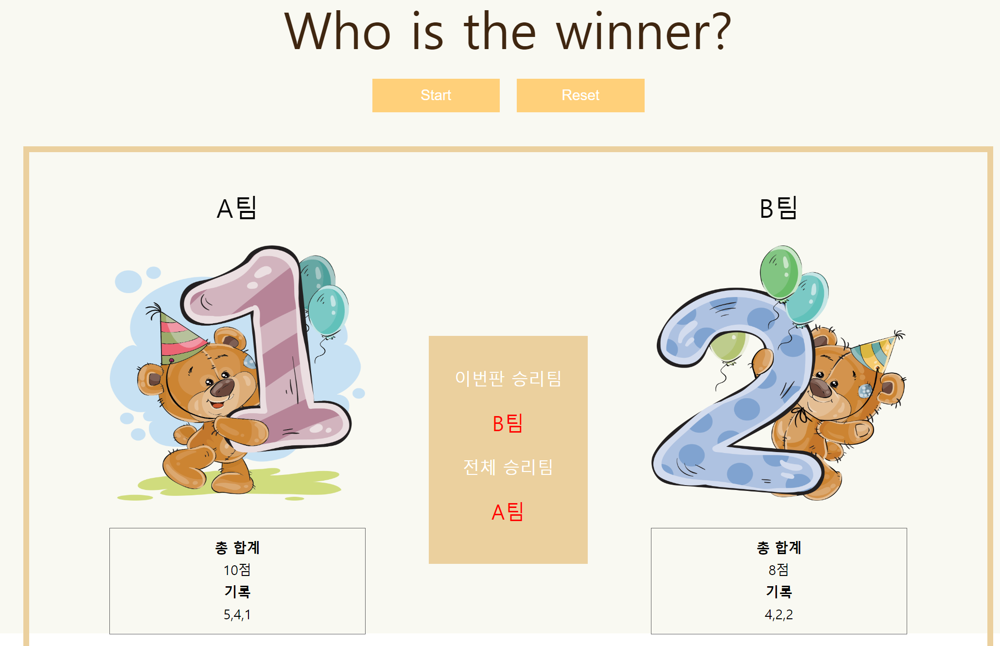

# React Card Game

  

## About This Project
  React를 사용하여 만든 간단한 카드 게임입니다.

## Stacks

## Skill

- Start 버튼을 클릭할 때 마다 게임이 시작됩니다.

- Reset 버튼을 클릭하면 모든 게임 전적이 리셋됩니다.

- 총합계에 게임의 결과가 누적 되고 기록에 게임의 결과가 기록됩니다.

- 이번판 승리팀엔 현재 게임에서 더 높은 점수가 나온 팀이 나타납니다.

- 전체 승리팀에는 누적 점수가 높은 팀이 표시됩니다.